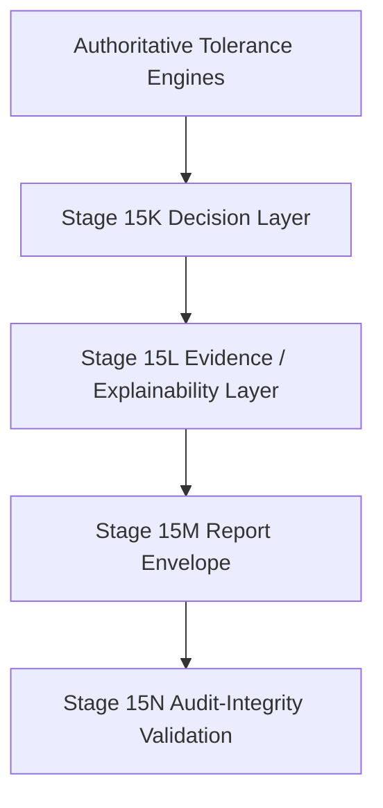

# Stage 15N: Deterministic Audit Integrity Validation

## Overview

This document defines the **Stage 15N: Deterministic Audit Integrity Validation** capability for the Origlyph AI tolerance stack.

Stage 15N implements a **deterministic, fail-closed integrity validator** for the complete tolerance decision pipeline, verifying internal consistency between:

- **Stage 15K decision result**
- **Stage 15L evidence bundle**
- **Stage 15L explanation**
- **Stage 15M decision report envelope**

It detects structural contradictions and broken references **without recomputing engineering calculations**.

## Architectural Position

Stage 15N sits **ABOVE** the Stage 15M report envelope and checks integrity only. It does NOT recompute authoritative engineering calculations.

## Purpose

**An integrity VALID result means the decision package is structurally consistent. It does NOT mean the engineering decision is PASS.**

The validator ensures that the report envelope accurately reflects the original pipeline outputs and maintains structural invariants required for audit and compliance.

## Key Properties

### Deterministic Identity
- **Decision ID consistency**: The validator verifies that `report.decision_id()` matches the report's canonical JSON identity. The current report contract returns canonical JSON, not a cryptographic hash.
- **Deterministic ordering**: Violation ordering is deterministic (severity → violation code → scope → subject → stable index).
- **Byte-stable serialization**: Uses standard library only (`json.dumps(..., sort_keys=True, allow_nan=False)`).

### Fail-Closed Policy
- **Malformed data**: Never returns VALID if unsupported or structurally inconsistent data is encountered.
- **Unsupported schema**: Returns `INCOMPLETE` for unsupported schema versions.
- **Validation errors**: Returns `INVALID` with detailed violation reports.

### No Engineering Recomputation
- **No engine calls**: Never calls:
  - `worst_case(...)`, `statistical(...)`, `validate_allocation(...)`
  - `reconcile_allocation(...)`, `reconcile_statistical_allocation(...)`
  - `evaluate_tolerance_decision(...)`
- **Read-only validation**: All operations are read-only and deterministic.

## Public API

The tolerance package exports the immutable integrity result and violation
models, their enums, `InvalidAuditIntegrityError`, and
`validate_decision_report_integrity(report)`.

The validator accepts an existing `ToleranceDecisionReport` and returns an
`AuditIntegrityResult`. Unsupported input types raise
`InvalidAuditIntegrityError`; unsupported report schema versions return an
`INCOMPLETE` result with an explicit violation.

## Validation Scope

The validator checks status and completeness consistency, reason-to-evidence
linkage, evidence identifier uniqueness, supported evidence sources,
contributor references encoded by canonical evidence identifiers, canonical
decision identity, serialization round-trip stability, and non-finite payload
values. Results and violations are immutable and emitted in deterministic
order.

The integrity result is a structural audit verdict, not a tamper-proof seal,
signature, or proof that the underlying engineering calculation is correct.
No cryptographic authenticity claim is made.
